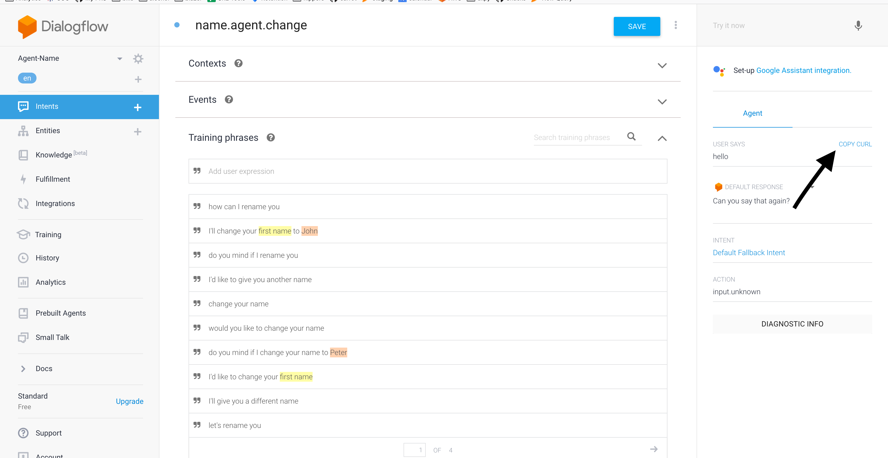

# MyApp
Please copy the curl command for your bot


This should give you something like
```
curl -H "Content-Type: application/json; charset=utf-8"  -H "Authorization: Bearer SECRET_CODE"  -d "{\"queryInput\":{\"text\":{\"text\":\"hello\",\"languageCode\":\"en\"}},\"queryParams\":{\"timeZone\":\"America/Los_Angeles\"}}" "https://dialogflow.googleapis.com/v2/projects/agent-name-pdnwdr/agent/sessions/50cc1f75"
```

and copy your `SECRET_CODE` to `chatbot.component.ts`

## Development server

Run `ng serve` for a dev server. Navigate to `http://localhost:4200/`. The app will automatically reload if you change any of the source files.

## Code scaffolding

Run `ng generate component component-name` to generate a new component. You can also use `ng generate directive|pipe|service|class|guard|interface|enum|module`.

## Build

Run `ng build` to build the project. The build artifacts will be stored in the `dist/` directory. Use the `--prod` flag for a production build.

